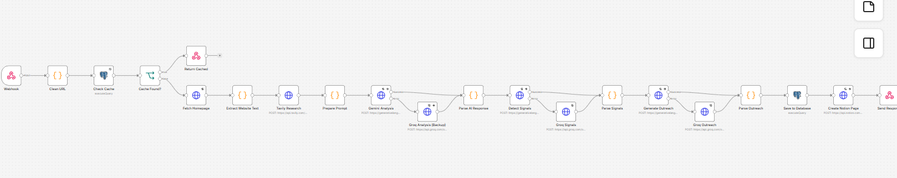
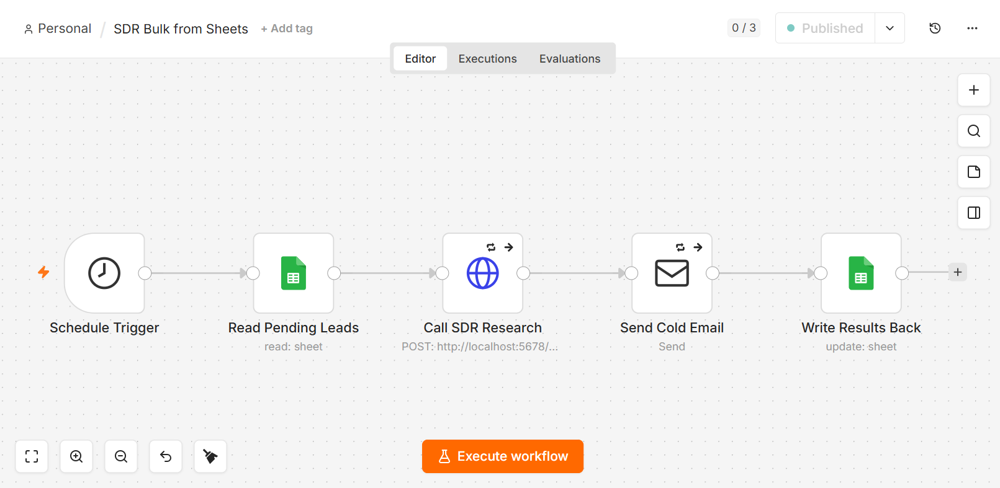
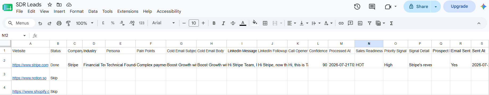
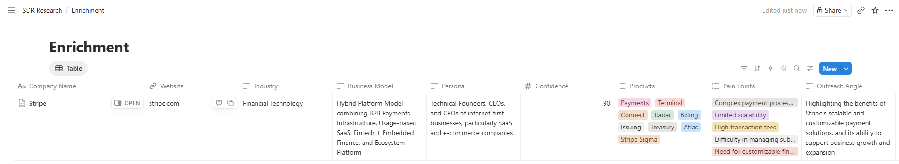
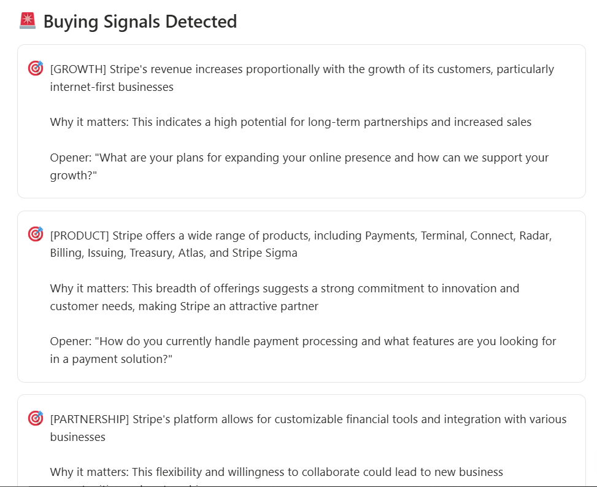
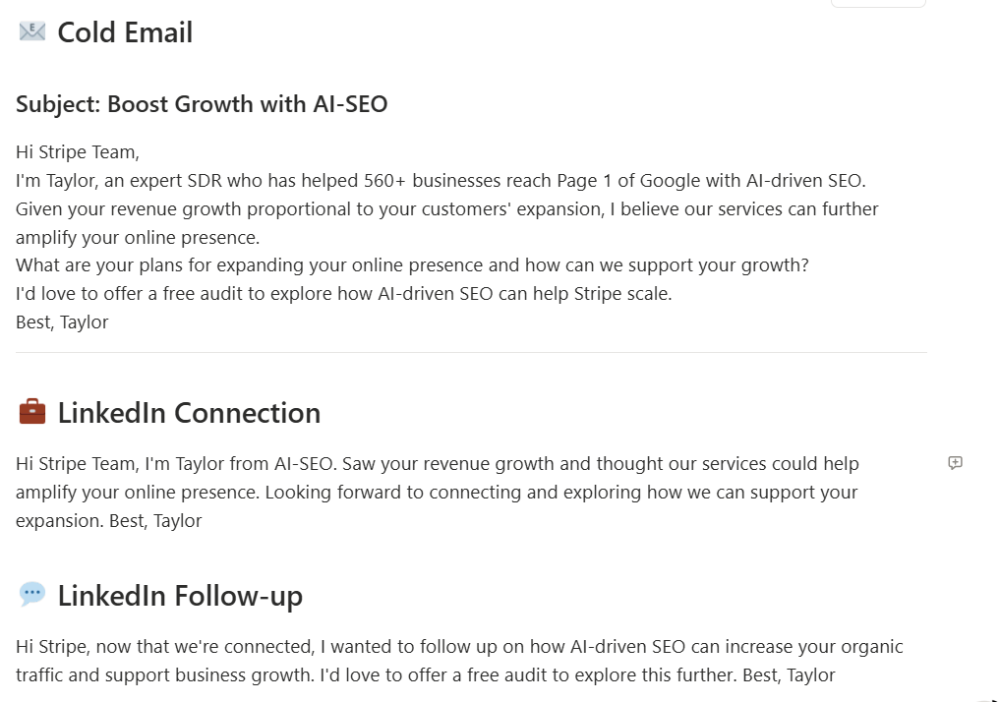
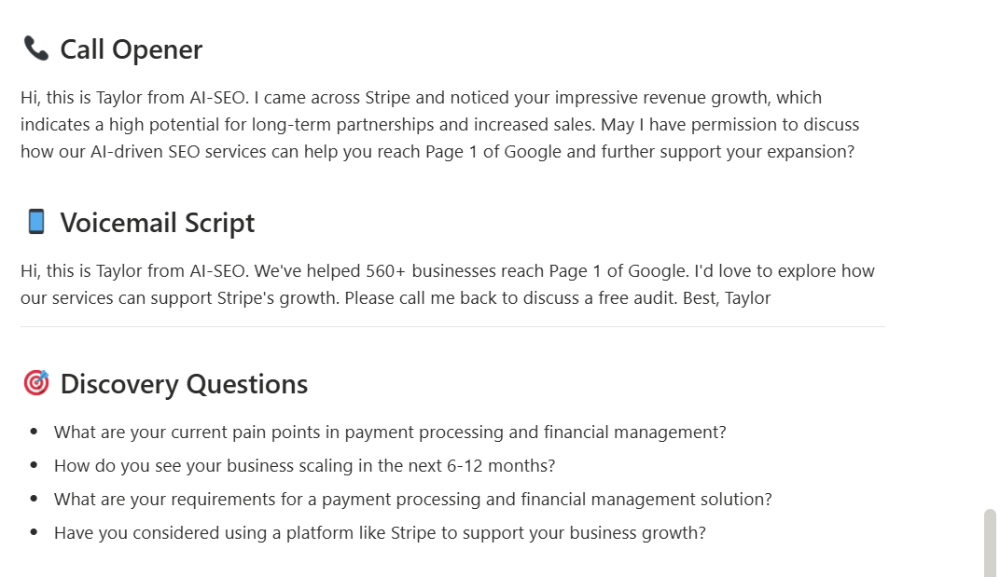
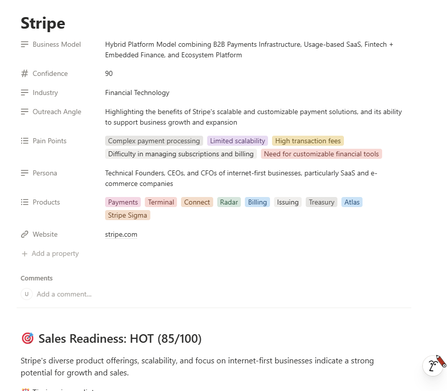

# AI-SDR-Automation
# 🚀 AI-SDR-Automation

**End-to-end AI-powered Sales Development Rep automation** — from company research to personalized cold email delivery, fully autonomous.

Built with **n8n**, **Google Gemini**, **Groq Llama 3.3**, **Tavily**, **PostgreSQL**, **Notion**, **Google Sheets**, and **Gmail SMTP**.

> Turn a company URL into a personalized cold email delivered to a prospect's inbox — in under 90 seconds.

---

## ✨ What It Does

Given just a company website URL, this system automatically:

1. **Crawls** the company's website (homepage, meta tags, key content)
2. **Researches** the company via Tavily AI web search
3. **Analyzes** with Google Gemini AI (industry, products, pain points, personas)
4. **Detects Buying Signals** (funding, hiring, growth, product launches, leadership changes)
5. **Rates Sales Readiness** as HOT / WARM / COLD (0-100 score)
6. **Generates Personalized Multi-Channel Outreach**:
   - Cold email (subject + body)
   - LinkedIn connection message
   - LinkedIn follow-up
   - Cold call opener script
   - Voicemail script
   - Discovery questions
7. **Caches** research in PostgreSQL (7-day freshness)
8. **Creates** beautifully formatted Notion pages
9. **Sends** the cold email automatically via Gmail
10. **Updates** Google Sheet with all results + email delivery status

---

## Architecture

### Two Workflows Working Together

**Main Workflow** — Single-URL research engine:
Webhook → Clean URL → Check Cache → Crawl Website → Tavily Research → Gemini Analysis (with Groq failover) → Detect Signals (with Groq failover) → Generate Outreach (with Groq failover) → Save to DB → Notion Page → Response


### 🛡️ AI Failover System

Every AI call has automatic failover:
- **Primary:** Google Gemini (`gemini-flash-latest`)
- **Backup:** Groq Llama 3.3 70B Versatile

If Gemini rate-limits or fails → Groq automatically takes over.  
Zero downtime, zero data loss.

---

## 📸 Screenshots

### 🔧 Main Workflow Canvas


### 🔄 Bulk Processing Workflow


### 📊 Google Sheets Bulk Processing
Real-time updates as workflow processes each lead:


### 📚 Notion Database View


### 🎯 Sales Readiness Score & Signals
Automatically detected HOT signals with conversation starters:


### ✍️ Auto-Generated Personalized Outreach
Cold email + LinkedIn messages in the sales rep's voice:


### 📞 Call Opener & Discovery Questions


### 🏢 Full Company Enrichment


---

## 🛠️ Tech Stack

| Layer | Technology | Purpose |
|-------|-----------|---------|
| **Workflow Engine** | n8n | Visual automation |
| **Primary AI** | Google Gemini Flash | Analysis + signals + outreach |
| **Failover AI** | Groq Llama 3.3 70B | Rate-limit resilience |
| **Web Research** | Tavily API | Real-time company intel |
| **Website Crawler** | HTTP + Custom Parser | Homepage content extraction |
| **Database** | PostgreSQL (JSONB) | Cached research reports |
| **Knowledge Base** | Notion API | Beautiful sales reports |
| **Bulk Processing** | Google Sheets API | Lead management |
| **Email Delivery** | Gmail SMTP | Automated cold email |

---

## 💡 Key Features

### 🎯 Buying Signal Detection
Not just research — actual **buying intent** detection across 10 categories:
- **FUNDING** – Recent rounds, IPO, acquisitions
- **HIRING** – Sales/marketing role openings
- **GROWTH** – Team expansion, new offices
- **PRODUCT** – Launches, feature releases
- **LEADERSHIP** – New CEO/CMO/CRO
- **TECHNOLOGY** – Tech stack changes
- **PARTNERSHIP** – New integrations
- **AWARDS** – Industry recognition
- **CHALLENGES** – Scaling pains
- **NEWS** – Recent announcements

### 🔥 Sales Readiness Scoring
Every lead scored 0-100:
- **HOT (75-100):** Multiple strong signals, buying urgency clear
- **WARM (40-74):** Some signals, worth outreach
- **COLD (0-39):** Generic value-based outreach

### 🤖 Multi-AI Failover
- If Gemini free tier hits rate limit → **Groq automatically takes over**
- If Gemini API errors → **Groq automatically takes over**
- Zero human intervention needed

### 📮 End-to-End Automation
Not just research — **actual email delivery**:
- Reads leads from Google Sheet
- Researches → Generates → Sends → Logs
- All in ~90 seconds per lead

---

## 🚀 Setup Instructions

### Prerequisites

- n8n (self-hosted via Docker or n8n Cloud)
- PostgreSQL 15+
- Free API keys: Gemini, Groq, Tavily, Notion
- Google Cloud Project (for Sheets OAuth)
- Gmail account with **App Password** (2FA enabled)

### Step 1 — PostgreSQL Setup

```sql
CREATE DATABASE sdr_researches;

CREATE TABLE companies (
    id SERIAL PRIMARY KEY,
    website TEXT UNIQUE NOT NULL,
    company_name TEXT,
    industry TEXT,
    business_model TEXT,
    products TEXT[],
    pain_points TEXT[],
    report_json JSONB,
    created_at TIMESTAMP DEFAULT CURRENT_TIMESTAMP
);

Step 2 — Get Free API Keys
Service	Get Key
Gemini	https://aistudio.google.com/apikey
Groq	https://console.groq.com/keys
Tavily	https://app.tavily.com
Notion	https://www.notion.so/profile/integrations

Step 3 — Import Workflows into n8n
Open n8n
Create new workflow → Import from File
Upload main-sdr-workflow.json
Repeat for bulk-sheets-workflow.json

Step 4 — Replace All Placeholders
In both JSON files, replace:

YOUR_GEMINI_API_KEY_HERE
YOUR_GROQ_API_KEY_HERE
YOUR_TAVILY_API_KEY_HERE
YOUR_NOTION_API_KEY_HERE
YOUR_NOTION_DATABASE_ID_HERE
YOUR_GOOGLE_SHEET_ID_HERE

Step 5 — Set Up n8n Credentials
PostgreSQL connection
Google Sheets OAuth2
SMTP (Gmail App Password: https://myaccount.google.com/apppasswords)

Step 6 — Create Notion Database
Columns required:

Company Name (Title)
Website (URL)
Industry (Text)
Business Model (Text)
Persona (Text)
Confidence (Number)
Products (Multi-select)
Pain Points (Multi-select)
Outreach Angle (Text)
Share the database with your Notion integration.

Step 7 — Create Google Sheet
Columns (in order):

text

Website | Status | Company | Industry | Persona | Pain Points | Cold Email Subject | Cold Email Body | LinkedIn Message | LinkedIn Followup | Call Opener | Confidence | Processed At | Sales Readiness | Priority Signal | Signal Detail | Prospect Email | Email Sent | Sent At

Step 8 — Test the API

curl -X POST http://localhost:5678/webhook/research \
  -H "Content-Type: application/json" \
  -d '{"website": "https://www.stripe.com"}'

Use Cases
🏢 SDR Teams — Automate lead research + cold outreach at scale
🎨 Agencies — Bulk-process prospect lists for clients
👨‍💻 Founders — Personalized outbound without hiring SDRs
💼 Freelancers — Client research automation
🧠 Sales Ops — Consistent, high-quality research pipeline

Performance
⚡ ~60-90 seconds per lead (research + email delivery)
🎯 95%+ confidence scores on well-known companies
💰 $0 infrastructure cost (all free tiers)
🔄 Zero downtime with AI failover system
📊 Scales to 100+ leads/day on free tier

📝 License
MIT License — Feel free to use, modify, and adapt for your needs.

👨‍💻 Built By
Ujjwal Bisen
GTM Engineer | AI Automation Specialist

🔗 GitHub
📧 Contact for freelance / consulting
